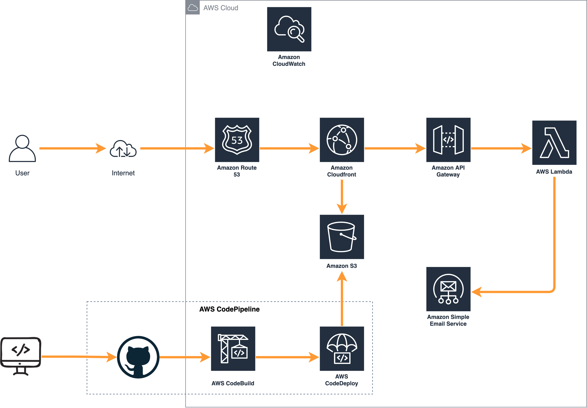

## Architecture

**End-to-end Architecture**

&nbsp;

**Frontend**

The contents and build artifacts of the website are stored in AWS S3. Amazon CloudFront caches the frontend content from S3, presenting the application to the user via a distribution. Route 53 is used as a DNS server routing to the CloudFront distribution.  

**Backend**

The core of the backend infrastructure consists of AWS Lambda, Amazon API Gateway and AWS SES. A Lambda function triggered by API Gateway POST request sends an email through AWS SES when I user submits an inquiry from the website.

**Developer Tool**
A CI/CD pipeline powered by AWS CodePipeline uses Github for code repository and AWS CodeBuild for building code changes. The build instruction are stored in the *buildspec.yml* file. AWS CodeDepoly copies the built artifacts into an S3 bucket which are cached by the CloudFront Distribution.  

<!--  -->